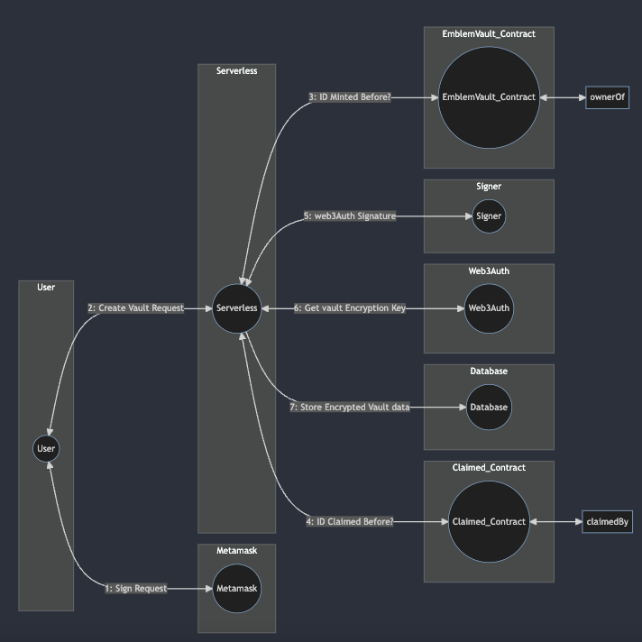
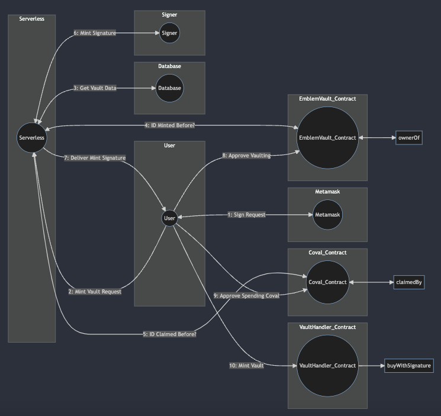
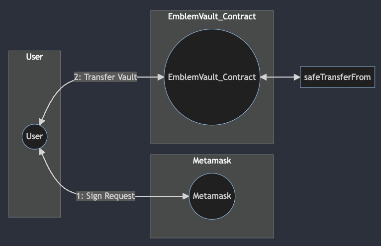
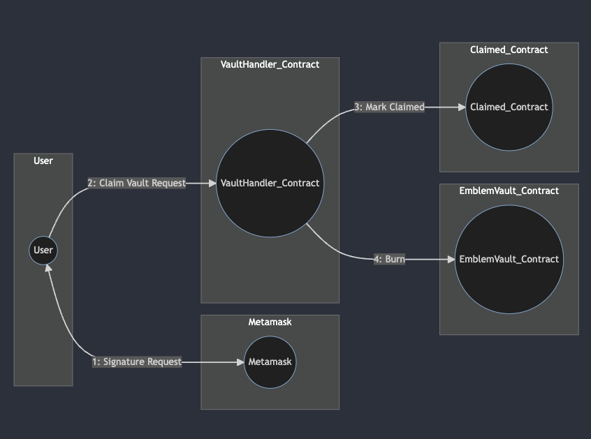
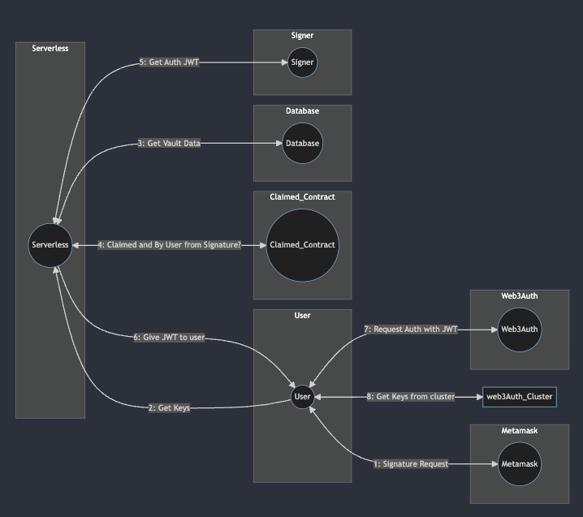

<!--https://mermaid.live/-->

### Create 
##### Users first create a vault record which contains everything needed to vault assets

### Mint
##### Users next mint their vault on the blockchain they chose in previous step

### Transfer
##### Users can transfer ownership of their vault without needing Emblem Vault services

### Claim
##### Users must burn their vault on chain before keys can be distributed

### Get Keys
##### Users may reconstruct keys after vault has been burnt
